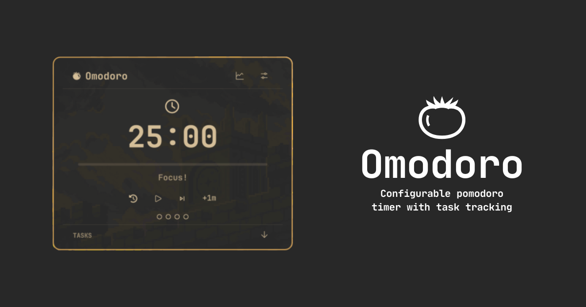

# Omodoro



Pomodoro technique timer and task tracker [quickshell](https://quickshell.org/) plugin for [Omarchy](https://github.com/omarchy)

## Features
- Create goals for your pomodoro sessions and track progress
- View your stats
- Choose between presets or create your own
- Customizable work/short break/long break intervals 
- Track your progress with stats
- Enable/disable notifications if you need them
- A small .json persistence file to preserve the stats, config and tasks

## Install

```sh
omarchy plugin add https://github.com/Pnkm0nK/Omodoro --enable
```

Move it on the bar using `--section right`, `--section left` or `--section center`:

```sh
omarchy bar move pnkm0nk.omodoro --section center
```

## Remove

```sh
omarchy plugin remove pnkm0nk.omodoro
rm -rf ~/.local/state/omarchy/omodoro.json
```
## Shortcuts

When the panel is open and focused:

| Key | Action |
| --- | --- |
| `Space` / `Enter` | Start / Pause timer |
| `r` / `R` | Reset current session |
| `n` / `N` | Skip to next session |
| `+` / `=` | Add 1 minute |
| `-` / `_` | Subtract 1 minute |
| `Esc` | Close panel |

